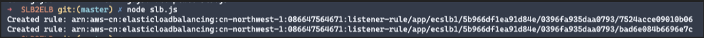

# 将阿里云SLB负载均衡规则复制到AWS ALB


[前文](https://github.com/liangfb/alicloudmigration)提到过，在给客户进行从阿里云迁移至AWS时，除了虚拟机、对象存储、数据等内容。还有客户由于系统的复杂性，已经在阿里云上设置了很多负载均衡规则来用于分发。这时对规则的重新创建工作是一项比较繁琐，以及容易出错的工作。我们可以通过自动化的方法，将用户以前在阿里云上创建的规则复制至AWS ELB之上，为此开发了这个将规则进行复制的工具：

该工具目前支持的负载均衡器类型包括：

·    阿里：SLB（七层）

·    AWS：ALB（七层）

在使用该工具之前，需要满足以下条件：

·    创建阿里云AK/SK

·    创建AWS AK/SK

·    在本地电脑上安装nodejs 

·    在AWS上创建好ALB和相关的TargetGroup

执行如下操作，完成负载均衡器到ALB的迁移

1. 从Github下载规则复制工具

```
git clone https://github.com/liangfb/SLBRulestoALB.git

cd SLBRulestoALB

npm install
```

2. 进行配置

- 编辑config.json文件

- 配置Alicloud和AWS的AccessKey和SecretKey

- 配置Alicloud和AWS的Endpoint和区域信息

- 配置需要创建AWS Application Load Balancer的VPC和在不同可用区的最少两个公有子网

- 配置需要迁移的阿里云SLB：

  - 填写阿里云上的SLB负载均衡Id

- 配置文件示例：
```
{
    "Alicloud":
    {
        "AccessKey": "LTasdfAI4G9XasdhD",
        "SecretKey": "w23fdsggzH6fasdftua9RCVnY",
        "Endpoint": "cn-zhangjiakou"
    },
    "AWS":
    {
        "AccessKey": "dfgEZYRPRI5JEVA",
        "SecretKey": "tpsdfgBYaoc6sdfgSUzAMmA3yz",
        "Region": "cn-northwest-1",
        "VPCId": "vpc-fcasdf",
        "Subnet":
        [
            "subnet-075645347",ß
            "subnet-3c2gfhdgdfh"
        ]
    },
    "SLB":
    [
        "lb-5345wugyhjfghjfhgj"
    ]
}
```

3. 运行

   ```
   node slb.js
   ```
   输出已创建的ALB, Listener, Target Group, Rules信息：

   

​                               

